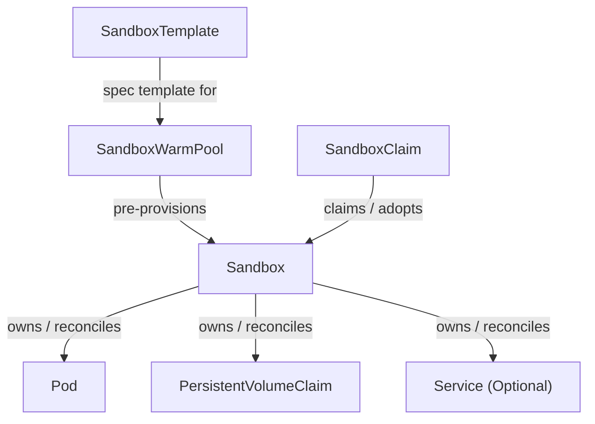
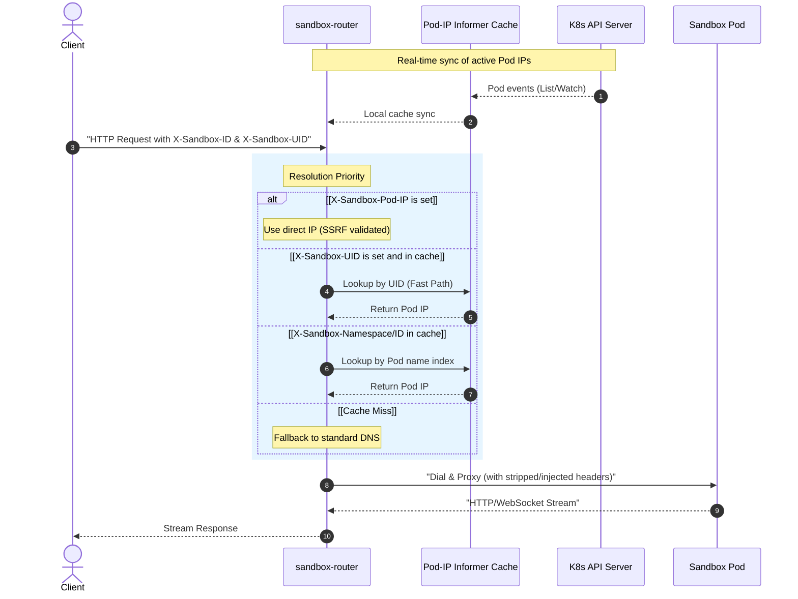

# Architecture

`agent-sandbox` splits its architecture into two distinct planes:
1. **Control Plane:** Reconciles declarative Custom Resource Definitions (CRDs) via Kubernetes operators, managing the lifecycle of warm pools and individual sandboxes.
2. **Data Plane (`sandbox-router`):** A high-performance, stateless reverse proxy that routes HTTP/WebSocket traffic to sandbox Pods in real-time, bypassing the slow Kubernetes service/DNS propagation path.

---

## Control Plane Architecture

The control plane is implemented as a set of Kubernetes controllers using the `controller-runtime` framework. It defines four main CRDs:

### Key Abstractions (Control Plane)

| Abstraction | Kind | Defined In | Controller Location | Role |
|---|---|---|---|---|
| **Sandbox** | `Sandbox` | `api/v1beta1/sandbox_types.go` | `controllers/sandbox_controller.go` | The atomic unit of execution. Manages a backing `Pod`, `Service` (optional), and `PersistentVolumeClaims`. Manages absolute expiration (`shutdownTime`). |
| **SandboxTemplate** | `SandboxTemplate` | `extensions/api/v1beta1/sandboxtemplate_types.go` | `extensions/controllers/sandboxtemplate_controller.go` | Declares shared container specs, resource limits, custom network isolation policies (`NetworkPolicy`), and constraints for claim injection policies. |
| **SandboxWarmPool** | `SandboxWarmPool` | `extensions/api/v1beta1/sandboxwarmpool_types.go` | `extensions/controllers/sandboxwarmpool_controller.go` | Pre-warms and scales a target number of unclaimed `Sandbox` resources based on a `SandboxTemplate`. Supports rolling updates (`Recreate` / `OnReplenish`) when the template updates. |
| **SandboxClaim** | `SandboxClaim` | `extensions/api/v1beta1/sandboxclaim_types.go` | `extensions/controllers/sandboxclaim_controller.go` | The user-facing request to checkout/adopt a ready `Sandbox` from a warm pool with low latency, or cold-start a customized one. Enforces post-claim TTLs. |

---

## Data Plane Architecture (`sandbox-router`)

The `sandbox-router` handles the high-volume data path. It uses an informer-based Pod-IP cache to bypass CoreDNS and dial Pod IPs directly.

### Key Abstractions (Data Plane)

| Component | Defined In | Role |
|---|---|---|
| **Router Server** | `sandbox-router/server/` | Boots the HTTP/WebSocket server, validates incoming `X-Sandbox-*` headers, strips sensitive fields, and routes requests to backends. |
| **Pod-IP Cache** | `sandbox-router/cache/` | Implements the local informer cache. Indexes pods by UID and by namespace/name, enabling O(1) in-memory resolution of Pod IPs without querying CoreDNS. |
| **Authz TokenReview** | `sandbox-router/authz/` | Leverages Kubernetes `TokenReview` API to validate the client's Bearer token and check if they are authorized to access the requested sandbox. |

---

## Isolation and Security Model

1. **Service Account Lockdown:** By default, if the user does not specify otherwise in the template, `AutomountServiceAccountToken` is forced to `false` for Sandbox Pods, preventing sandboxed processes from calling the Kubernetes API.
2. **Network Isolation:** The `SandboxTemplate` controller generates a dedicated, shared `NetworkPolicy` for all sandboxes matching its template. By default, it applies a strict secure posture:
   - **Ingress:** Block all traffic *except* from the `sandbox-router`.
   - **Egress:** Allow Public Internet only; blocks internal RFC1918 private subnets and the cloud metadata server (preventing SSRF).
3. **SSRF Protections in the Router:** If `X-Sandbox-Pod-IP` is supplied to bypass DNS/cache, the router validates that the IP is not in a restricted class (loopback, multicast, link-local, cloud metadata).
4. **Credential Stripping:** The router consumes the `Authorization` header for its own TokenReview and strips it before forwarding the request to the upstream sandbox.
