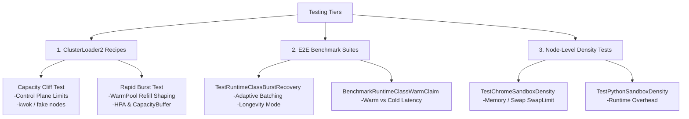

# Scale, Stress, and Performance Testing

**Date: September 26, 2026**  
**Topic:** Comprehensive analysis of scale and stress testing suites, performance tuning parameters, and options for future improvement.

---

## 1. Landscape of Scale and Stress Testing Options

The `agent-sandbox` repository maintains three distinct testing tiers to measure performance, throughput, and stability boundaries:



### Tier 1: ClusterLoader2 (CL2) Recipes
Located in `dev/load-test/` and `dev/load-test/test-recipes/`, these use Kubernetes' standard scale-testing framework to generate massive concurrent object workloads.
*   **Capacity Cliff Test (`run_capacity_cliff.sh`)**: Answers how many `Sandbox` objects a cluster can hold before performance degrades.
    *   **Mechanism**: Ratchets up sandbox counts in discrete step increments (via `STEP_SIZE` and `TOTAL_STEPS`).
    *   **Pass/Fail Condition**: Object *convergence* within a timeout (`CONVERGENCE_TIMEOUT`), rather than raw latency.
    *   **Fake Nodes**: Integrates with [kwok](https://kwok.sigs.k8s.io/) fake nodes (`KWOK_NODES=true`) to bypass scheduling/CRI resource exhaustion and isolate pure control-plane capacity (etcd, apiserver, controller reconciliation).
    *   **Dataplane Stress**: Can enable `NETWORK_POLICY=true` to apply "Secure by Default" ingress/egress blocks per namespace, monitoring Cilium identity scaling.
*   **Rapid Burst Test (`run_rapid_burst.sh`)**: Simulates spikes of rapid client requests to measure warm pool adoption speed.
    *   **Mechanism**: Fires discrete bursts of `SandboxClaim` objects (`BURST_SIZE` × `TOTAL_BURSTS`) targeting pre-warmed pools.
    *   **Autoscaling Validation**: Integrates with Custom Metrics HPAs targeting `SandboxWarmPool` and GKE `CapacityBuffer` to scale standby node pools.

### Tier 2: Go E2E Benchmark Suites
Located in `test/e2e/`, run via `make test-e2e-benchmarks`.
*   **Burst Recovery Test (`TestRuntimeClassBurstRecovery`)**: Simulates sustained batch loads that deplete the warm pool.
    *   **Adaptive Batching**: Features dynamic back-pressure — batch sizes scale down when `ReadyReplicas ≤ 1` and scale back up once the pool recovers above 50%.
    *   **Longevity Mode**: Triggered with `SANDBOX_LONGEVITY= duration` (e.g., `2h`), running continuous claims to stress test long-term stability and informer leakages.
*   **Claim Benchmarks (`BenchmarkRuntimeClassWarmClaim` & `BenchmarkRuntimeClassColdStart`)**: Clean, micro-benchmark measurements of warm-adoption vs. cold-start latencies across images and pool sizes.
*   **Parallel Claims (`BenchmarkWarmPoolParallelClaim`)**: Claims all members of a warm pool concurrently to verify locks, lock-free structures (`ConcurrentMap`), and watch-event race safety.

### Tier 3: Node-Level Density Tests
Located in `test/e2e/extensions/`, run with the flag `-run-perf-load-test=true`.
*   **Density Sweeps**: Deploys up to `-density=N` specialized pods (e.g., `TestChromeSandboxDensity`, `TestPythonSandboxDensity`) onto a single node to measure local resource pressure, startup milestones (Scheduled → Running → Ready), and swap limits.

---

## 2. Controller Performance Tuning Parameters

Sustained scale testing has produced a robust set of controller parameters to mitigate API server choke points:

```
                                      [Controller Workers]
                                    /-- sandbox: 200
[Client Claims] ---> [API Server] ----- claim: 150
                                    \-- warm-pool: 2 (1 per active pool)
```

1.  **API Connection Sharding**: `--api-connections=4` splits non-watch mutating writes across separate TCP sessions to circumvent HTTP/2 stream limitations (100 streams/conn). `--separate-watch-connection=true` isolates informer stream reads from write bursts.
2.  **Worker Concurrency Sizing**: The optimal benchmarked ratio is **200 sandbox / 150 claim / 2 warm-pool** workers. Exceeding 1000 total workers increases API write conflict rates (409s).
3.  **Refill Shaping**: 
    *   `--sandbox-warm-pool-max-refill-rate=100` uses a per-pool token bucket to pace creations, reducing scheduler spikes and achieving a ~15% p50/p90 latency reduction.
    *   *Warning*: `--sandbox-warm-pool-replenish-delay` (deferring refill until claim quietness) is highly fragile; a single API timeout can drain the pool and spike latency from milliseconds to 200s.
4.  **Write Coalescing**: `--sandbox-write-behind-window=250ms` defers non-critical pod metadata updates. It reduces 409 conflicts by 44% but increases sustained latency by 58% — best suited for purely bursty workloads.
5.  **Informer Scoping**: `--cache-label-selectors=true` filters Pod/Service caches to sandbox-labeled resources, reducing memory and JSON decode overhead from $O(\text{cluster pods})$ to $O(\text{sandbox pods})$.

---

## 3. Recommended Improvement Directions for Scale Tests

To further harden the system under high load, the following extensions to the existing scale suites are recommended:

*   **Custom Metrics over PodStartupLatency**: Currently, the CL2 capacity test warns that `PodStartupLatency` only measures downstream pod readiness. Replace this with `GenericPrometheusQuery` scraping `agent_sandbox_creation_latency_ms` to capture the controller's full end-to-end orchestration overhead.
*   **Automated Controller Upgrade Resync Test**: Informer re-lists on startup are the leading cause of API server collapse at scale. Incorporate an automated step in `run_capacity_cliff.sh` that performs a `rollout restart` of the controller at the maximum converged plateau, timing its recovery.
*   **Network Latency & Partition Simulation**: Introduce simulated control plane latency (e.g., tc-netem or Chaos Mesh) during the `TestRuntimeClassBurstRecovery` run to observe how the adaptive batch size algorithm and `rawpatch` lockouts survive API slow-downs.
*   **Prometheus Cardinality Filtering**: Large-scale capacity cliff tests (e.g., 50k+ sandboxes) face Prometheus OOMs. Apply targeted relabel configs in the test's `monitor/` config to drop high-cardinality metrics (like cAdvisor or individual node scraper tags) and focus exclusively on core etcd and control-plane memory.
